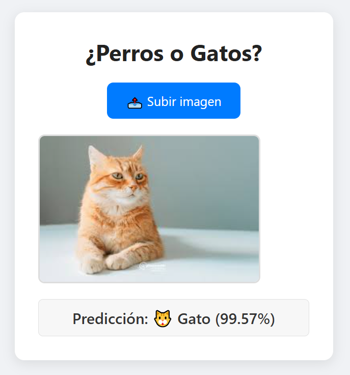

## ¿Perros🐶o Gatos🐱?

Esta Tarea es un proyecto web que permite clasificar imágenes como **perro** o **gato** usando un modelo de redes neuronales entrenado con Keras y exportado a TensorFlow.js

---

### Pasos

1. Abre una terminal en la carpeta del proyecto.
2. Ejecuta el siguiente comando:

```bash
npx http-server . -p 8080
```

3. Abre el navegador y ve a:

```bash
http://localhost:8080
```

4. Probar con imagenes de perros o gatos /images/test.jpeg


---

### Explicación

Para convertir el modelo `.h5` de Keras a TensorFlow\.js, usé el siguiente comando desde la terminal:

```bash
tensorflowjs_converter --input_format=keras model.h5 model_tfjs/
```

Tuve problemas de compatibilidad al usar otras versiones. La **clave** fue:

1. **Establecer Keras 1** desde el cuaderno con:

   ```python
   import os
   os.environ["TF_USE_LEGACY_KERAS"] = "1"
   ```
2. Leer cuidadosamente la [documentación oficial de conversión](https://www.tensorflow.org/js/guide/conversion?hl=es).
3. Revisar este artículo sobre [compatibilidad entre TensorFlow y Keras](https://keras.io/getting_started/#tensorflow--keras-2-backwards-compatibility).

Con esto, la conversión y el uso del modelo en el navegador funcionaron correctamente.

---

### Entorno de ejecución

Y usar un entorno en anaconda con las siguientes versiones

* **Python:** 3.10.18
* **TensorFlow:** 2.10.0
* **Keras:** 2.10.0
* **TensorFlow\.js:** 3.18.0

---