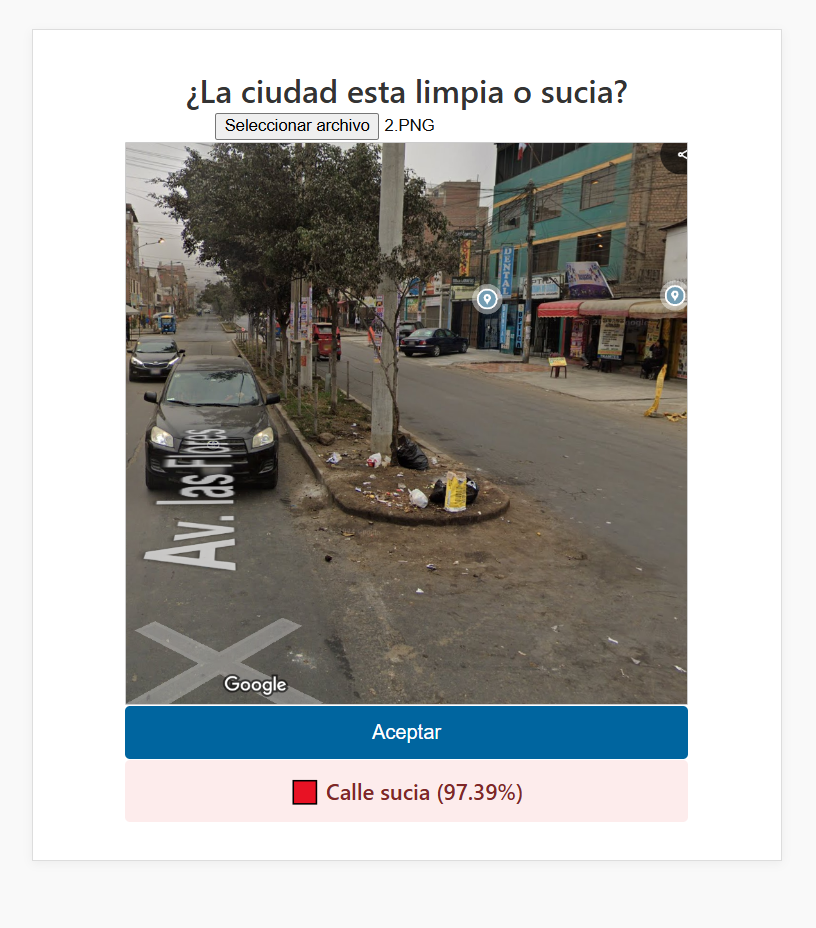
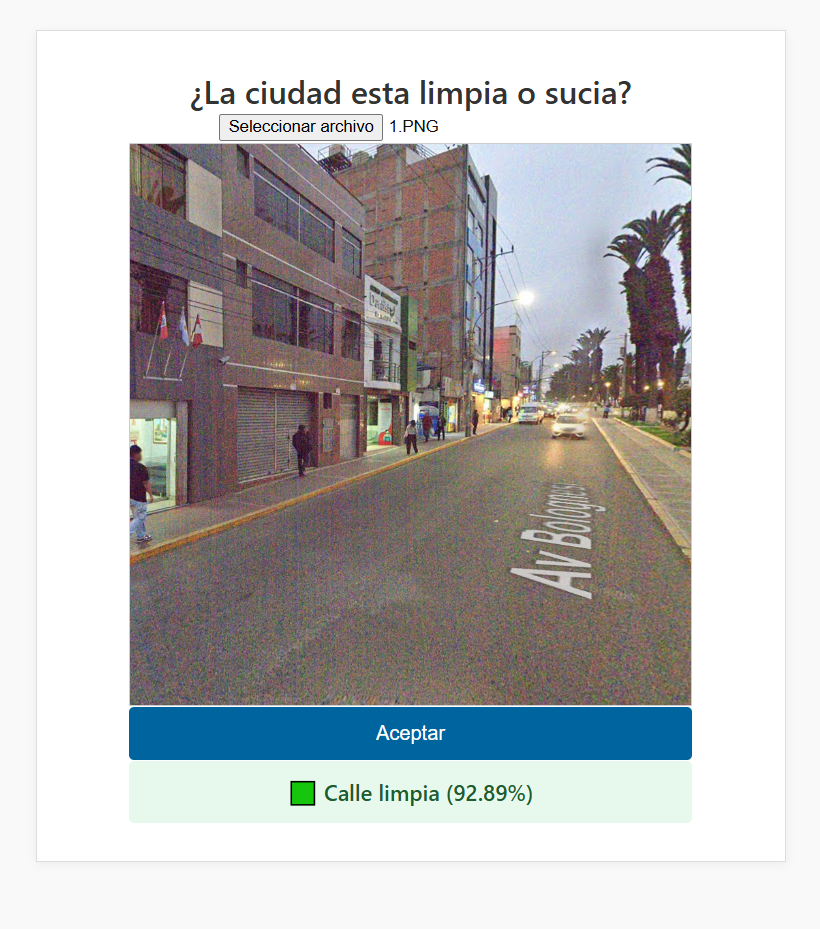

# Entregable - Trabajo Final

Este proyecto nace con el objetivo de ganar experiencia práctica en visión por computadora. Es buena idea desarrollar un sistema inteligente que alerte sobre zonas en mi ciudad que presenten acumulación de basura, utilizando cámaras de seguridad. Esta idea surgió observando el estado de las calles de mi ciudad.

La acumulación de basura impacta negativamente en la calidad del entorno urbano, afectando la salud, la imagen de la ciudad y el bienestar general de sus habitantes.

---

## 🚀 Uso

1. Descarga los archivos `index.html`, `style.css` y `script.js`, junto con la carpeta `modelo_tfjs`.

2. Abre una terminal en la carpeta del proyecto y ejecuta:

   ```bash
   npx http-server
   ```

3. Abre tu navegador y accede a la dirección local que te muestra (por ejemplo: `http://localhost:8080`).

---

¿Quieres que también revise y corrija el resto del documento por completo?


## 🗂️ Dataset

Link: https://www.kaggle.com/datasets/nw8vqlafd/street-classification-dataset

El dataset tiene un tamaño de aproximadamente 1 GB y contiene tres carpetas: `clean`, `litter` y `recycle`. Para este proyecto, decidí eliminar la carpeta `recycle`, ya que el enfoque principal es la **detección de puntos con alta presencia de basura**, no el reciclaje.

### Estructura del dataset

| Clase  | Total | Train (80%) | Test (20%) |
|--------|-------|-------------|------------|
| clean  | 1825  | ≈1460       | ≈365       |
| litter | 1705  | ≈1364       | ≈341       |

Creé una carpeta llamada `dataset`, que contiene subcarpetas para entrenamiento (`train`) y prueba (`test`), con sus respectivas carpetas `clean` y `litter`. Esta organización es crucial para evaluar correctamente el rendimiento del modelo.

---

## Convolutional Neural Network

Las imágenes fueron procesadas con `ImageDataGenerator` para aplicar normalización y aumentos (rotaciones, escalados, etc.), y luego codificadas como clases binarias:

- `0` → Calle limpia (`clean`)
- `1` → Calle sucia (`litter`)

El modelo fue construido usando **Sequential**. En el notebook puedes encontrar la explicación detallada del proceso.

### Elementos clave del modelo:

- **Dropout**: Previene el sobreajuste (overfitting).
- **Función de activación Sigmoid**: Lo ideal para clasificación binaria.
- **Función de pérdida `binary_crossentropy`**: Evalúa qué tan bien está funcionando el modelo.

### Entrenamiento

Inicialmente entrené el modelo con 10 épocas, obteniendo:

- **Precisión en entrenamiento**: 89.77%
- **Precisión en validación**: 87.82%

Para mejorar el rendimiento, implementé ``EarlyStopping``, permitiendo conservar la mejor versión del modelo con base en `val_loss`. También incrementé el número de épocas a 20 para optimizar el aprendizaje sin caer en sobreajuste.

- **Precisión mejorada en entrenamiento**: 94.05%
- **Precisión mejorada en validación**: 92.63%

El modelo fue guardado y convertido a TensorFlow.js usando **Miniconda en WSL** (Frecuemente uso este entorno para evitar problemas de compatibilidad durante la exportasión).

---

## 🌐 WebApp

Se desarrolló una aplicación web utilizando HTML, CSS y JavaScript, que permite subir imágenes de calles urbanas y clasificarlas en tiempo real usando TensorFlow.js.

- Al subir una imagen, se muestra si la calle está limpia o sucia.
- La predicción se presenta visualmente con colores y porcentaje.
- El modelo.h5 fue previamente entrenado con una precisión superior al **90%**.

### ¿Cómo funciona?

- Si la probabilidad es **mayor a 0.5**, se clasifica como **calle sucia**.
- Si es **menor a 0.5**, se clasifica como **calle limpia**.

### Ejemplo de calle limpia



### Ejemplo de calle sucia


---

## ⚙️ Versiones

> **Sistema de entrenamiento: Anaconda**

- Python 3.9
- TensorFlow 2.10.1
- Numpy 1.24.3
- Pillow, Matplotlib, Scipy
- TensorFlow.js 4.8.0 (En Windows Subsystem for Linux)

---

## 💬 Comentario final

Estuve probando el modelo y funciona correctamente. El dataset es útil para detectar bolsas de basura y calles limpias. Sin embargo, debido a que las imágenes provienen principalmente de ciudades europeas no es lo mejor para el contexto de nuestro pais, el modelo podria equivocarse en las respuestas.

Es decir tiene una mejora clara a la hora de entrenar el modelo con un dataset personalizado al entorno de nuestras calles limpias y sucias.

La idea final es utilizar cámaras de seguridad para identificar zonas críticas con acumulacion de basura y tomar acción enviando alertas en tiempo real.

---
